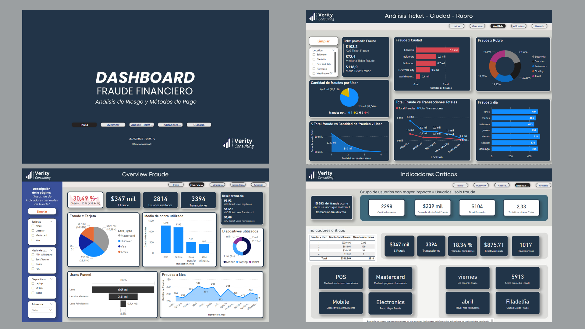

# 📊 Dashboard de Análisis de Fraude Financiero

Este proyecto presenta un tablero interactivo en Power BI que permite analizar transacciones financieras fraudulentas y detectar patrones críticos a partir de distintas variables. El análisis combina visualizaciones, segmentaciones y medidas DAX para entregar información útil a equipos de riesgo, seguridad y estrategia.

---

## 🧠 Objetivo del Proyecto

Identificar factores de riesgo y patrones comunes asociados a transacciones fraudulentas para fortalecer los mecanismos de prevención y detección. Este análisis está enfocado en dispositivos, métodos de pago, comportamiento transaccional y reincidencias.

---

## 🛠️ Herramientas Utilizadas

- Power BI (medidas DAX, visualizaciones interactivas)
- SQL (extracción y limpieza de datos)
- Google Sheets (transformaciones previas)
- GitHub (documentación y versionado)

---

## 📌 Contenidos del Tablero

- **Overview general**: KPIs clave del fraude, funnel de usuarios y línea de tiempo mensual.
- **Análisis de Ticket - Ciudad - Rubro**: Segmentación por monto, localización y actividad comercial.
- **Indicadores críticos**: Reincidencias, días críticos, métodos de autenticación y más.
- **Glosario**: Definiciones de métricas y variables para claridad del análisis.

---

## 📷 Ejemplo del Dashboard

---

## 📄 Documentación Completa

Encontrá la descripción completa del proyecto, hipótesis, alcance, medidas calculadas y más en el siguiente PDF:

📥 [`Fraude_Financiero_Luis_Arbio(1).pdf`](docs/Fraude_Financiero_Luis_Arbio(1).pdf)

---

## 🔮 Futuras líneas de mejora

- Implementación de modelos de **Machine Learning** para predicción de fraude.
- Segmentación avanzada de usuarios por comportamiento.
- Enriquecimiento del dataset con fuentes externas (scoring, historial, localización).
- Detección automática de anomalías para activar alertas en tiempo real.

---

## 📬 Autor

**Luis Arbio**  
Proyecto desarrollado como ejemplo práctico de análisis de fraude con enfoque estratégico y técnico.

---
